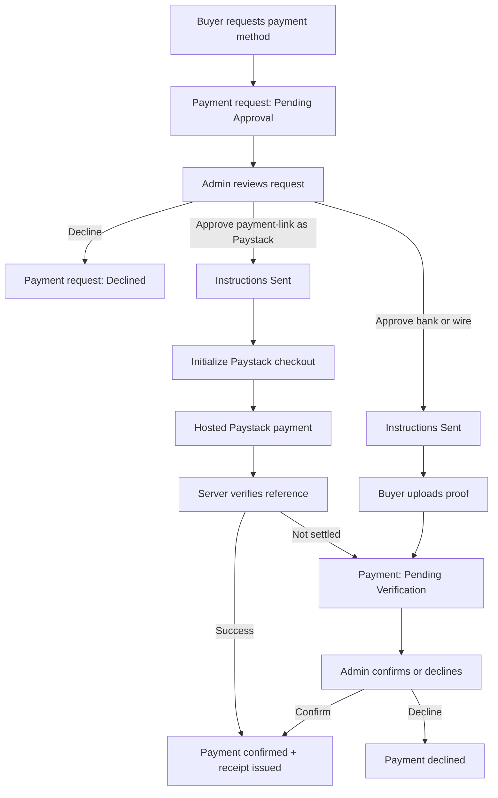

# Prestige Motors Marketplace

A modern React + Vite frontend with an Express API for a luxury car marketplace focused on transparent installment financing, inspection-first trust messaging, delivery eligibility rules, and buyer/admin dashboards.

## Features

- Premium car inventory with USD and NGN pricing
- Search and filter by brand, location, price, and payment type
- Financing application flow with deposit and duration selection
- Delivery requests only after confirmed deposit or approved financing
- User dashboard for favorites, applications, receipts, payment plans, and notifications
- Admin dashboard for inventory management and financing approvals
- Business address, testimonials, FAQ, privacy, and terms content

## Run locally

### Terminal 1

```powershell
npm run server
```

### Terminal 2

```powershell
npm run client
```

The frontend runs on `http://localhost:5173` and proxies API requests to `http://localhost:4000`.

If you want the client to call a different backend during development, copy `client/.env.example` to `client/.env` and set `VITE_API_BASE_URL`.

If you plan to run ads on Facebook, Instagram, TikTok, or Google Search, also set these frontend environment values with your real platform IDs:

- `VITE_META_PIXEL_ID`
- `VITE_TIKTOK_PIXEL_ID`
- `VITE_GOOGLE_TAG_ID`
- `VITE_GOOGLE_ADS_ID`

Launch references:

- Campaign setup and ad copy: `docs/paid-media-playbook.md`
- Launch checklist and production env handoff: `docs/ad-launch-checklist.md`
- Frontend production env template: `client/.env.production.example`

For backend environment configuration, copy `server/.env.example` to your Render env settings or local shell.

## Tech stack

- Frontend: React 19 + Vite
- Backend: Node.js + Express
- Data layer: SQLite-backed JSON collections in `server/data/database.sqlite`

## Deploy with GitHub + Render

This repo is ready for a GitHub-connected Render deployment using the root [render.yaml](render.yaml) blueprint.

### What gets deployed

1. A Render web service for the Express API.
2. A Render static site for the React frontend.
3. A persistent disk mounted to the API so the SQLite database survives restarts.

### GitHub to Render flow

1. Push this project to a GitHub repository.
2. In Render, choose `New +` -> `Blueprint`.
3. Connect the GitHub repository.
4. Render will detect [render.yaml](render.yaml) and propose two services:
	- `prestige-motors-api`
	- `prestige-motors-web`
4. For the API service, choose a Render plan that supports persistent disks.

### Required environment values in Render

After the first blueprint import, set these values in Render:

1. On the static site `prestige-motors-web`:
	- `VITE_API_BASE_URL` = your API URL, for example `https://prestige-motors-api.onrender.com`
	- `VITE_META_PIXEL_ID` = your Meta Pixel ID for Facebook and Instagram campaigns
	- `VITE_TIKTOK_PIXEL_ID` = your TikTok Pixel ID
	- `VITE_GOOGLE_TAG_ID` = your main Google tag ID
	- `VITE_GOOGLE_ADS_ID` = your Google Ads conversion tag ID when separate from the main tag
2. On the web service `prestige-motors-api`:
	- `FRONTEND_ORIGIN` = your frontend URL, for example `https://prestige-motors-web.onrender.com`
	- `AUTH_TOKEN_SECRET` = a long random secret used to sign login tokens
	- `PAYSTACK_SECRET_KEY` = your Paystack secret key for server-side initialize and verify calls
	- `PAYSTACK_PUBLIC_KEY` = optional public key reference for dashboard visibility
	- `PAYSTACK_CURRENCY` = checkout currency, for example `USD` or `NGN`

Then redeploy both services.

### Optional production environment values for the API

Set these on `prestige-motors-api` when you want to replace demo placeholders without changing code:

1. `COMPANY_NAME`
2. `COMPANY_ADDRESS`
3. `COMPANY_PHONE`
4. `COMPANY_EMAIL`
5. `COMPANY_HOURS`
6. `ADMIN_FULL_NAME`
7. `ADMIN_EMAIL`
8. `ADMIN_PHONE`
9. `ADMIN_PASSWORD`
10. `ADMIN_LOGIN_HINT_EMAIL` if you intentionally want a public admin email hint on the login page
11. `AUTH_TOKEN_SECRET` to sign API bearer tokens; set a long random value in every non-local environment
12. `PAYSTACK_SECRET_KEY` to enable hosted Paystack checkout for approved `payment-link` requests
13. `PAYSTACK_PUBLIC_KEY` if you want to surface provider configuration state in the app or future client-side enhancements
14. `PAYSTACK_CURRENCY` if your merchant account settles in a currency other than the default `USD`

### Paystack webhook

For production, set your Paystack dashboard webhook URL to:

`https://your-api-host/api/payments/paystack/webhook`

The server verifies the `x-paystack-signature` header and uses successful `charge.success` events to finalize hosted checkout payments even if the buyer does not return to the site.

### Local Paystack test flow

For local UI and workflow testing without a live Paystack account, set this in `server/.env`:

```env
PAYSTACK_TEST_MODE=mock
```

In mock mode:

1. Approved `payment-link` requests still initialize through the normal API.
2. The returned Paystack checkout URL redirects straight back to the car page callback.
3. The server treats verification as a successful Paystack test payment and issues the receipt.

That gives you a browser-testable end-to-end checkout path locally while keeping production behavior tied to real Paystack keys and webhook verification.

## Payment flow

The app now uses a split payment model:

1. The buyer requests a deposit or full-payment method.
2. Admin approves the method and sends instructions.
3. Bank and wire payments move into verification instead of instant confirmation.
4. `payment-link` requests can launch hosted Paystack checkout.
5. Paystack verification or admin verification is what produces a confirmed receipt.



### Render service settings already included

1. API build command: `npm install`
2. API start command: `npm start`
3. API health check path: `/api/health`
4. Frontend build command: `npm install && npm run build`
5. Frontend publish directory: `dist`
6. SPA rewrite route so deep links like `/cars/cadillac-escalade-v-2024` work directly on Render

### Important deployment notes

1. The API stores data in SQLite, so the Render API service must keep its persistent disk attached.
2. If you deploy the API on a sleeping plan, the first API request after inactivity may be slow.
3. Uploaded proof files are currently stored inside the SQLite-backed data flow, which is acceptable for a demo but not ideal for production scale.
4. Authentication now uses signed bearer tokens, but it still does not include refresh tokens, rate limiting, or hardened production controls.

## Production notes

- Add authentication before exposing the admin dashboard publicly
- Store payments and applications in a database
- Enable HTTPS/SSL and move secrets to environment variables
- Review attribution and commercial-use requirements for all catalog and brand media before launch
- Replace the example company contacts and the sample admin password in `server/.env.example` with real production values

## Monitoring and backup

The API now exposes two production-friendly system endpoints:

1. `GET /api/health`
Returns a lightweight health payload with status, timestamp, uptime, and version so you can attach Render health checks or an external monitor.

2. `GET /api/admin/system/status`
Returns admin-only runtime details including uptime and collection counts.

3. `GET /api/admin/system/export`
Returns an admin-only JSON backup of the current SQLite-backed collections and computed meta payload as a downloadable file.

Example backup flow:

```powershell
curl -H "x-user-id: <admin-user-id>" https://your-api-host/api/admin/system/export -o prestige-motors-backup.json
```
